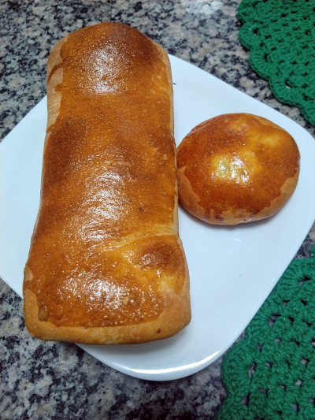

# Pão de Batata

> Pão de batãããta

## Ingredientes

| Ingrediente         | Quantidade            |
|---------------------|-----------------------|
| Batata              | 170g ― Peso dela crua |
| Leite Integral      | 240ml                 |
| Sal                 | 1 colher de chá       |
| Açúcar refinado     | 0.5 colher de chá     |
| Azeite              | 1 colher de sopa      |
| Fermento seco       | 5g ― meio pacotinho   |
| Farinha de Trigo    | 340g                  |
| Catupiry p/ rechear | Opcional & À gosto    | 

## Utensílios

- Amassador de Batata ― Você pode usar um garfo para isso, mas se você gosta de
  purê de batata e afins, algum tipo de amassador é uma boa ideia

- Uma bacia grande para mexer tudo

- Peneira ― Opcional, útil para caso seu purê de batata fique com pedaços &
  também útil para peneirar a farinha

## Preparo

### 01 ― Purê

- Lave e descasque a batata
- Corte em cubos de mais ou menos 1cm
- Coloque numa panela com água o suficiente até cobrir
- Adicione sal na água
- Leve a panela ao fogo, quando ferver conte 10min
- Amasse um pouco a batata ― Não se preocupe em deixar ela num purê perfeito ainda.
  No próximo passo com adição de leite e azeite fica mais fácil

### 02 ― Batata & Leite

- Na panela do purê adicione todo o azeite e o leite aos poucos, em fogo baixo
- Amasse a batata entre os momentos que adiciona o leite, para ajudar a formar
  o purê
- Adicione então o restante do leite e todo o sal & açúcar
- Quando a mistura começar a ferver, desligue e deixe ficar morno

---
> É importante deixar a mistura esfriar um pouco para que ela não mate o fermento
---

### 03 ― Farinha, Fermento & Primeira Fermentação

- Numa bacia adicione a farinha, se tiver uma peneira, peneire a farinha ao
  adicionar

- Misture o fermento à farinha

- Adicione a mistura de purê & leite na farinha, mexa com uma espátula ou colher
  de pau

---
> Separe uma porção extra de farinha em uma tigela antes de enfiar a mão na massa
> é útil para corrigir o ponto
---

- Misture bem a massa, dissolvendo a farinha na mistura líquida. Quando você notar
  que a mistura está pesada demais para mexer com uma colher, use as mãos

- Se você tiver uma superfície disponível, jogue um pouco de farinha nela e
  continue sovando lá

- Provavelmente a massa vai estar um tanto grudenta ainda, vá adicionando farinha
  aos poucos enquanto sova

---
> É difícil explicar como sovar pão por texto. Talvez vídeos sejam melhores.
> [Como sovar, com o Shimura](https://www.youtube.com/watch?v=sXcr4bnz4MA)
> [Como sovar, com o TudoGostoso](https://www.youtube.com/watch?v=lF0AcU0n-Fg)
> [Como sovar, com Solange Lima](https://www.youtube.com/watch?v=eyJRkjlUhqw)
> [How to Knead, Allrecipes](https://www.youtube.com/watch?v=ySOj0fFWo1U)
>
> Muita coisa em panificação é difícil explicar sem estar junto e treinando,
> mas com prática a sua técnica vai melhorar bastante! Panificação sofre efeitos
> da mão de quem tá fazendo, da temperatura ambiente, do quão equilibrado o
> forno é... Enfim, não desanime se você estiver fazendo seus primeiros
> pães agora! Continue praticando que você vai perceber o que funciona
---

- Quando a massa estiver sovada ― de 10min a 15min ― limpe e passe azeite na bacia que você usou

- Junte a massa numa bola, coloque na bacia e gire ela pela bacia para cobrir de
  azeite

- Cubra a bacia com um pano úmido e deixe descansar por duas horas

### 04 ― Modelagem & Segunda Fermentação

- Passadas as duas horas, é hora de dar o formato. Você pode escolher entre fazer
  um pão grande ou pães menores, recheados ou não

- Primeiro, pressione levemente a massa na bacia para tirar o ar de dentro dela,
  vire ela numa superfície limpa e sove por mais uns 2min

- Se você tiver uma forma de pão de forma/bolo inglês, você pode simplesmente
  passar um pouco de óleo dentro delas, jogar a massa dentro e pressionar de leve
  a massa na forma. Passe um pouco de azeite na superfície do pão também

- Para fazer pães recheados, depois da segunda sova, corte a massa entre 6 e 8
  pedaços, de acordo com o tamanho que você deseja

- Abra cada pedaço na mesa como se fosse uma pizza pequena, coloque o recheio no
  meio e puxe pontas da massa sobre o recheio, fechando os pãezinhos

---
> Modelar pão em bolinhas, assim como sovar, também é melhor visto do que lido
> algumas referências boas são:
> [How to Shape Bread Rolls](https://www.youtube.com/watch?v=TB908K3Kd6k)
> [How to Shape Up Rolls](https://youtu.be/Gx2Sf3XqkhQ?t=105)
> [Como Fazer Pão de Hambúrguer](https://youtu.be/_QYLWe8qu8E?t=275)
>
> Só tome cuidado que como o pão é recheado, o recheio pode vazar se você
> apertar muito
---

- Se você for fazer recheado, coloque os pães numa assadeira untada ou com papel manteiga

- Seja como for, depois de modelado, cubra a assadeira e deixe descansar por 1h

### 05 ― Assando

- Quando faltar 30min para o tempo, ligue o forno à 200ºC

- (Opcional) Quebre um ovo, adicione um pouco de sal, bata ele bem e pincele sobre os pães
  Se você quiser uma cor mais escura, use só gema ou gema e um pouco de clara.
  Se quiser mais claro, use um ovo inteiro.

- Asse o pão por 15min. Abra o forno e vire a forma dentro do forno, de maneira
  que a parte de trás fique para frente.

- Asse por mais 10min-20min. O total vai depender bastante do seu forno. Observe
  o pão de tempos em tempos

## Fontes

https://www.simplyrecipes.com/recipes/homemade_potato_bread/

https://www.acasaencantada.com.br/confeitaria/paes/pao-de-batata/

